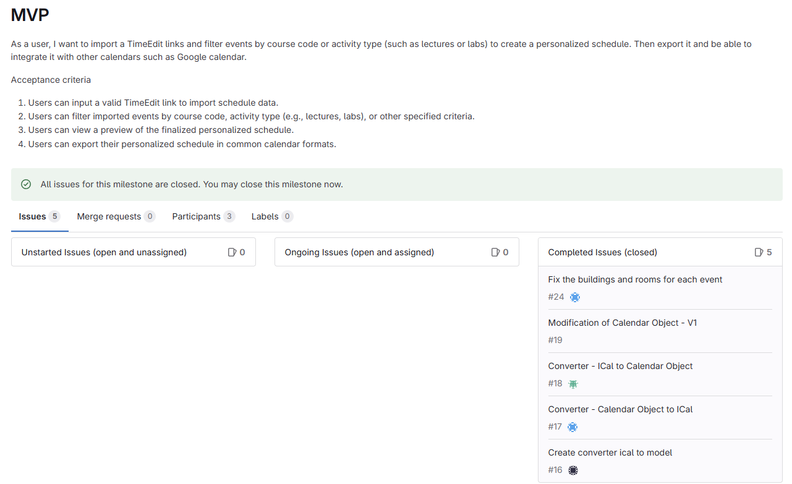
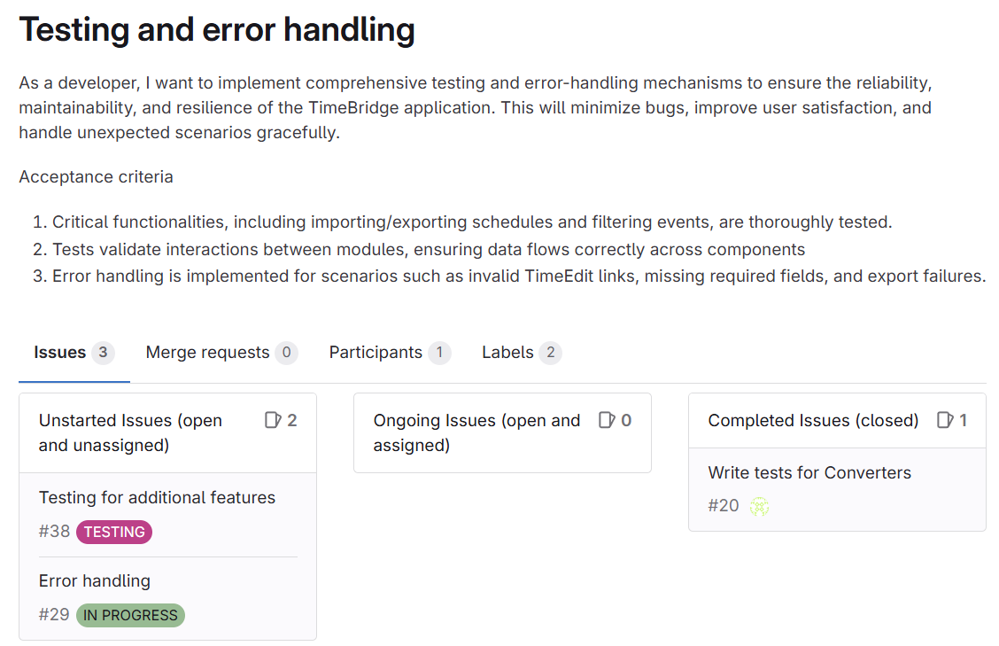
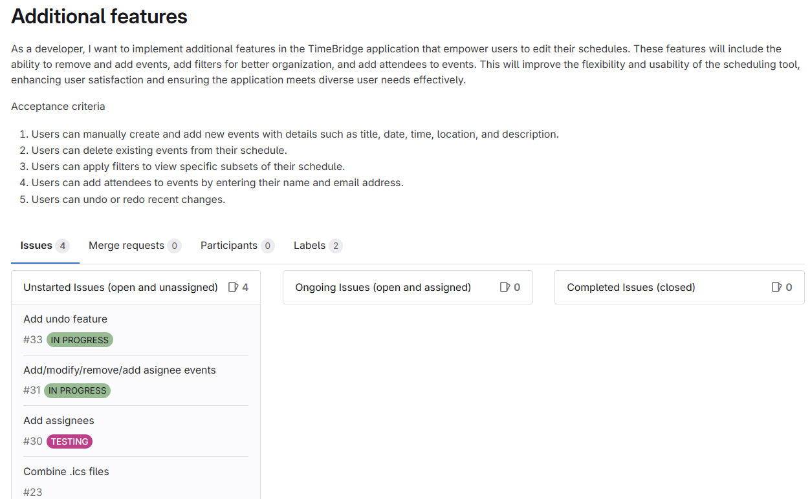

# Requirement Analysis Document

## Introduction - TimeBridge

Our project, TimeBridge, is a *calendar management app* similar to Chalmer's calendar app "TimeEdit".
 
While the already existing TimeEdit works well, it can sometimes be hard to organize or customize the calendar to fit specific needs of the students. Our goal with this project, is therefore to make a calendar manager app that makes TimeEdit calendars more user-friendly and easy for the user to customize. 

With TimeBridge, you can directly import your TimeEdit links and filter events by course code or activity type (such as lectures or labs) to create a personalized schedule. You’ll also be able to view your schedule, apply your preferences, and export it as an ICS file or use a link to integrate with other calendar tools like Google Calendar. Additionally, you can add a TimeEdit link containing courses that both you and your friends are attending to our application, assigning attendees to each event to easily distinguish between your own course events and those of your friends.

## Requirements
These are the following textual requirements for our project:

### Functional Requirements:
1. The system shall allow users to import their schedules directly from TimeEdit using a valid URL link.
2. The system shall enable users to filter events by course code.
3. The system shall allow users to filter events by activity type (For example lectures, labs..)
4. The system shall provide functionality for cleaning up event titles by removing unnecessary course codes and duplicate course names.
5. The system shall provide functionality for assigning events to specific individuals or teammates.
6. The system shall allow users to export their customized calendar as an ICS file.
7. The system shall allow users to export the calendar as an ICS file or calendar link.

### Non-functional Requirements:
1. The system shall have an intuitive user interface that is easy to navigate.
2. Filtering or customizing events shall update the calendar view in real time.

### GUI Mockups
Based on these requirements, we created a GUI mockup in Figma. Our goal is to create a user interface that is clean, visually appealing and easy for the user to navigate. 
This is what our Figma prototype looked like for our product:

Since our initial Figma prototype, we have made adjustments based on user testing feedback and the constraints of the UI systems we are working with. This is how our current version of the UI looks like:

### User Stories
These are our main epics, with the user stories included:

### DoD: Definition of Done
We are working on stories by using GitLab's issue feature. Each issue corresponds to a user story, and they are open when they are in progress, and closed when they are considered done. 
But how do we know when a story/issue is truly done?

This is our DoD, definition of *done*:

#### Functionality:
1. The feature works as intended and meets all acceptance criteria outlined in the associated user stories.

#### Code/testing:
2. The code has passed all our unit tests.
3. The code is of high quality, follows suitable design principles, coding standards, and is written to be extensible for future development.

#### User Interface:
4. The appearance of the UI mostly aligns with the design of our Figma-prototype.
5. The design has been tested and reviewed through user feedback, with positive results.

## Domain Model
This is our domain model over TimeBridge:

