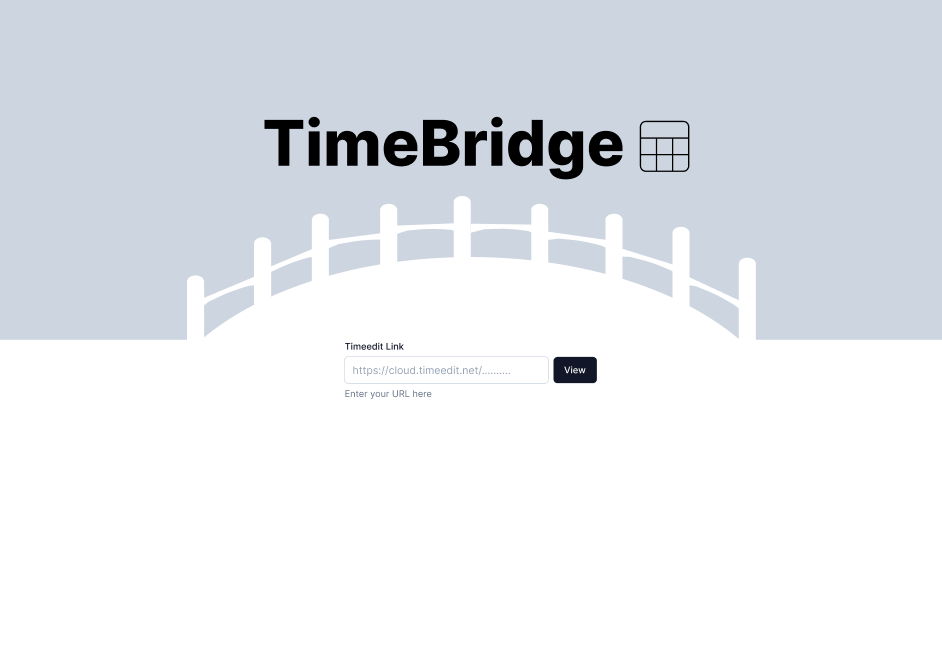
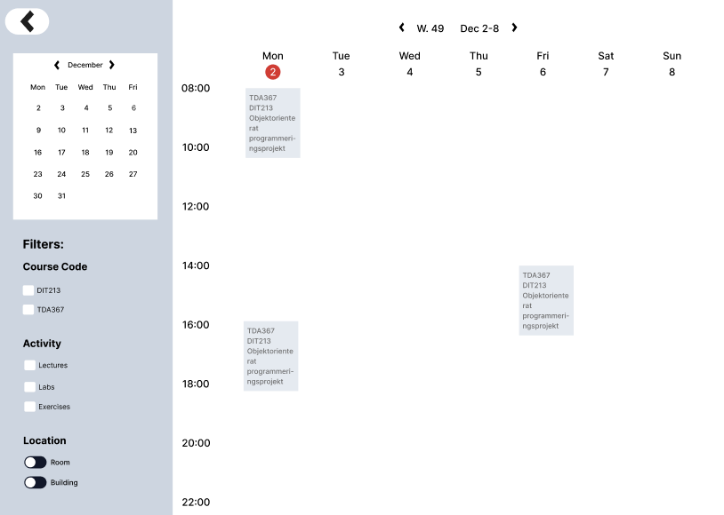
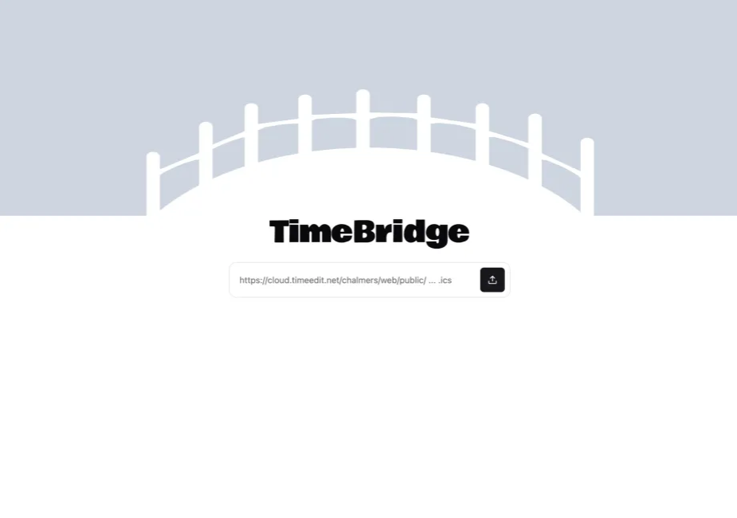
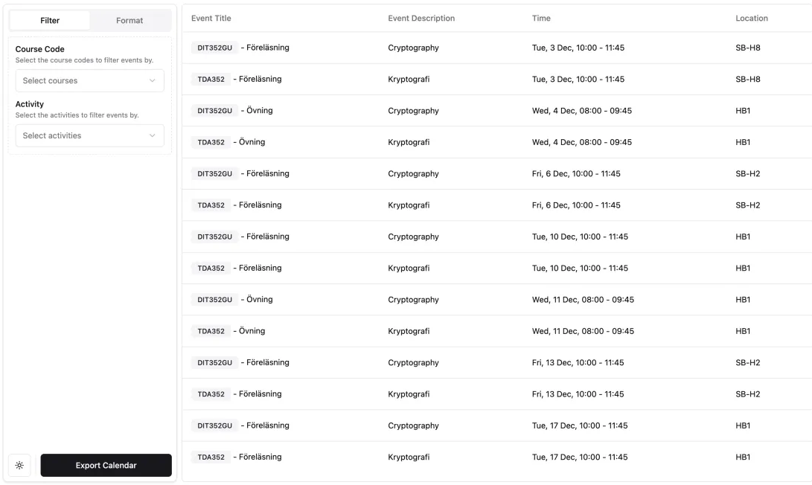
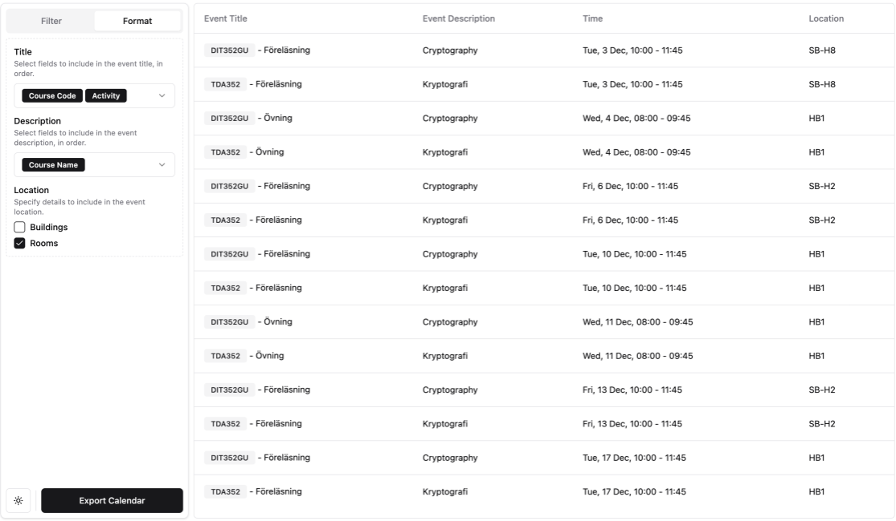
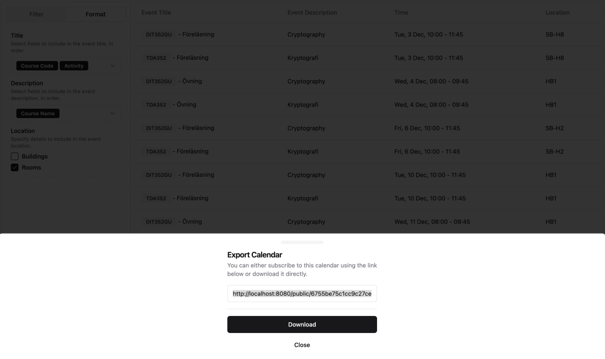
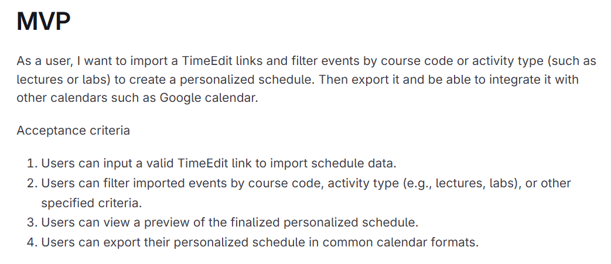
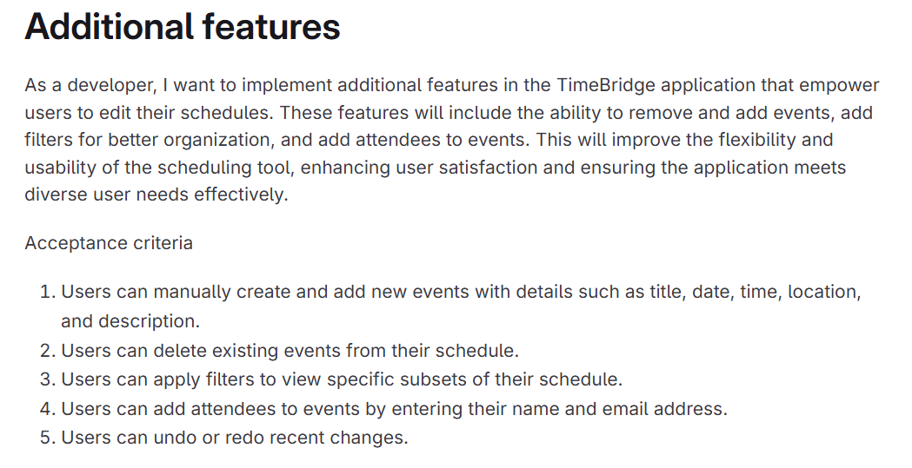
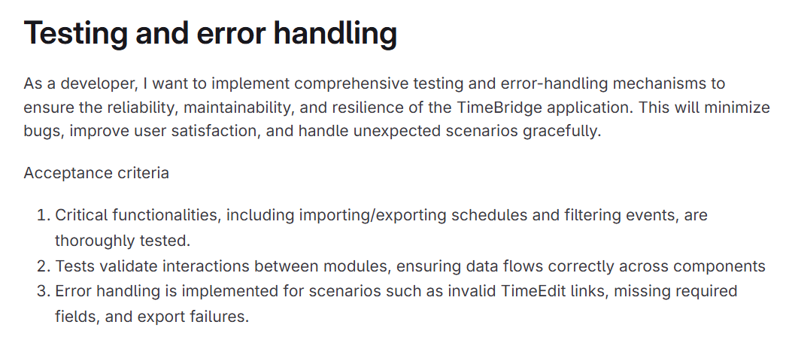

# Requirement Analysis Document

## Table of Contents

1. [Introduction](#introduction---timebridge)  
   Introduction to TimeBridge and its purpose.  

2. [Requirements](#requirements)  
   Functional and non-functional requirements, GUI mockups, epics, user stories, and the Definition of Done (DoD).  

3. [Domain Model](#domain-model)  
   Visual representation of the domain model for TimeBridge.  

## Introduction - TimeBridge

Our project, TimeBridge, is a *calendar management app* similar to Chalmer's calendar app "TimeEdit".
 
While the already existing TimeEdit works well, it can sometimes be hard to organize or customize the calendar to fit specific needs of the students. Our goal with this project, is therefore to make a calendar manager app that makes TimeEdit calendars more user-friendly and easy for the user to customize. 

With TimeBridge, you can directly import your TimeEdit links and filter events by course code or activity type (such as lectures or labs) to create a personalized schedule. You’ll also be able to view your schedule, apply your preferences, add your own personalized calendar events, and export it as an ICS file or use a link to integrate with other calendar tools like Google Calendar. Additionally, it is possible to assign attendees to the different events in the calendar app. This makes it possible to create a combinded schedule, with both your own courses, as well as the courses of your friends or lab partners, and easily distinguish between your own course events and those of your friends. This feature is something we believe is extra helpful when trying to plan group activities, such as labs. 

## Requirements
These are the following textual requirements for our project. These requirements works as a guideline when developing the product, as well as works as a foundation for when creating user stories.

### Functional Requirements:
1. The system should allow users to import their schedules directly from TimeEdit using a valid URL link.
2. The system should enable users to filter events by course code.
3. The system should allow users to filter events by activity type (For example lectures, labs..)
4. The system should provide functionality for cleaning up event titles by removing unnecessary course codes and duplicate course names.
5. The system should provide functionality for assigning events to specific individuals or teammates.
6. The system should allow users to export their customized calendar as an ICS file or calendar link.

### Non-functional Requirements:
1. The system should have an intuitive user interface that is easy to navigate and use.
2. Filtering or customizing events should update the calendar view in real time.

### GUI Mockups
Based on these requirements, we created a GUI mockup in Figma. Our goal is to create a user interface that is clean, visually appealing and easy for the user to navigate. 
This is what our Figma prototype looked like for our product:

Since our initial Figma prototype, we have made adjustments based on user testing feedback and the constraints of the UI systems we are working with. This is how our current version of the UI looks like:

### Epics and User Stories
These are our main epics, which represent a bigger goal that we aim to achieve in this project. Each epic is then broken down into multiple smaller user stories, which works like tasks that all must be completed before the epic is considered done. 

Epic 1 - Minimal Viable Procuct:

From this epic, these are the user stories that has been created:

User Story 1: _As a developer, I want to call the API and send a Calendar object in JSON format, and convert it to an ICal._

Acceptance criteria:

* The new ical file contains the same information as the original plus the additional modifications
* The ical file is of the correct format

User Story 2: _As a user I want to see each room in the same building without it being repeated for each room if they are in the same building._

Acceptance criteria:

* Each building is only shown once
* No buildings or rooms are missing

User Story 3: _As a developer, I want to be able to convert an Ical file to a calendar object, to be able to modify the object._

Acceptance criteria:
* It should be able to convert a valid ical file to a calendar object.

User Story 4: _As a developer, I want to be able to call the API and send a Calendar Object with modification settings, and get back a modified Calendar Object._

Acceptance criteria:

* Calendar object should contain all additional modifications
* No information from the original calendar object should be missing

Settings:
* Filter by course code.
* Choose if only building or room or both should be visible.

User Story 5: _As a user, I would like to visually see my calendar, on a neat and visually appealing website, that is easy to navigate._

Acceptance criteria:
* The calendar should be able to be presented to the user as a website interface.
* It should be easy to navigate and understand

Epic 2 - Additional Features:

From this epic, these are the user stories that has been created:

User Story 1: _As a user I want to be able to add attendees to every event, so that I easily can distinguish between my own events and my friends events._

Acceptance criteria:
* Attendees contain Name and Mail
* Attendees should be optional in an event

User Story 2: _As a user I want to be able to add my own events, edit events and delete events, to be able to make a personalized schedule._

Acceptance criteria:
* Added events must contain the most basic information
* Every event should contain an event ID
* The calendar should be saved to the database

User Story 3: _As a user I want to be able to undo the filters and modifications that I have done to the schedule, to be able to see the original schedule again._

Acceptance criteria
* A user can undo the last few modifications
* There is a button for this on the website

User Story 4: _As a developer, I want comprehensive Javadoc documentation for the extensions that have been made, so that I and others reviewing the code can easily understand its purpose, usage and behavior._

Acceptance Criteria:   
* Every suitable public class, method, and field should have descriptive Javadoc comments.   
* Parameters, return values, and exceptions should be clearly documented.   
* Adhere to the [project’s documentation standards/guidelines].

Epic 3 - Testing and error handling:

From this epic, these are the user stories that has been created:

User Story 1: _As a user, I want the system to handle errors gracefully when importing my schedule using a link, so that I can understand what went wrong and take appropriate action._
Acceptance criteria:
* A user should clearly know what went wrong, by seeing a error message on the screen.
* All error cases should be handeled

### DoD: Definition of Done
We are working on stories by using GitLab's issue feature. Each issue corresponds to a user story, and they are open when they are in progress, and closed when they are considered done. 
But how do we know when a story/issue is truly done?

This is our DoD, definition of *done*:

#### Functionality:
1. The feature works as intended and meets all acceptance criteria outlined in the associated user stories.

#### Code/testing:
2. The code has passed all our unit tests.
3. The code is of high quality: follows suitable design principles, coding standards, and is written to be extensible for future development.

#### User Interface:
4. The appearance of the UI mostly aligns with the design of our Figma-prototype.
5. The design has been tested and reviewed through user feedback, with positive results.

## Domain Model
This is our domain model over TimeBridge:

