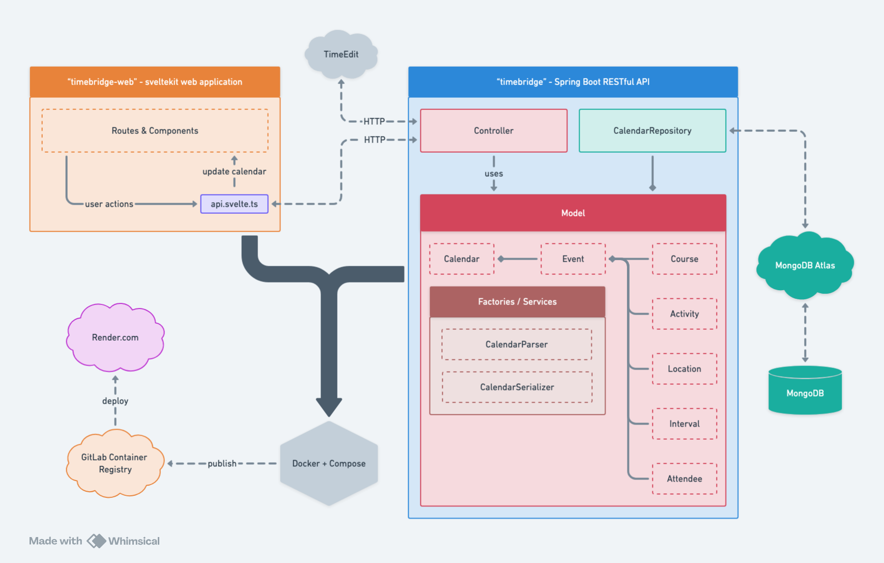
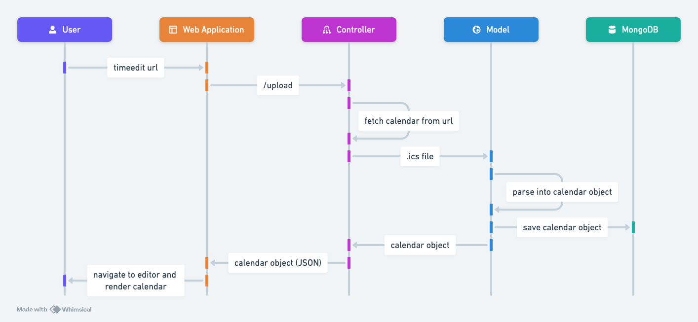
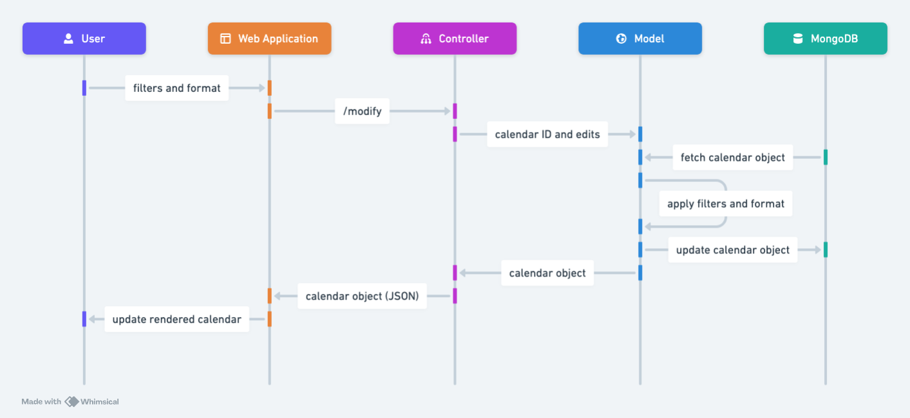
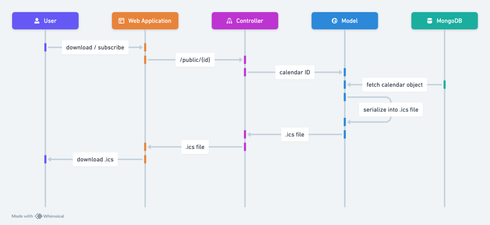

# Software Design Document - TimeBridge

## Table of Contents

1. [Introduction](#introduction)
2. [Scope](#scope)
3. [Definitions](#definitions)
4. [References](#references)
5. [Overview](#overview)
6. [Design](#design)
7. [Implementation](#implementation)
8. [Testing](#testing)
9. [Appendix](#appendix)

## Introduction

TimeBridge is a calendar management application designed to enhance the user experience by allowing users to fetch calendar data from TimeEdit. The app provides functionalities to edit and customize the imported calendars according to individual preferences. Users can filter events, assign them to specific individuals, and clean up event titles. Once the calendar is tailored to their needs, users can export it as an ICS file or subscribe to it using a calendar link, ensuring seamless integration with other calendar tools like Google Calendar.

## Scope

This software design document outlines the design and implementation of TimeBridge. It covers an broad overview of the system, while also delving into the specifics of the model-view-controller architecture. The document also includes some sequence diagrams to illustrate the flow of control in the system.

## Definitions

- **TB**: TimeBridge, the calendar management application.
- **TE**: TimeEdit, the calendar service from which TB fetches calendar data.
- **ICS**: iCalendar file format, used for storing calendar data.
- **API**: Application Programming Interface, a set of rules and protocols for building and interacting with software applications.
- **MongoDB**: A NoSQL database used to store user data in TB.

## References

- [iCalendar Specification](https://tools.ietf.org/html/rfc5545)
- [MongoDB Documentation](https://docs.mongodb.com/)
- [Spring Boot Documentation](https://docs.spring.io/spring-framework/docs/current/reference/html/web.html)
- [Svelte Documentation](https://svelte.dev/docs)
- [ShadCN Documentation](https://next.shadcn-svelte.com/)
- [Tailwind CSS Documentation](https://tailwindcss.com/docs)

## Overview

TimeBridge is built using a MVC architecture and is divided into three main components: the backend server, the frontend client, and the database.

### Backend Server

The backend server is built using Spring Boot, with the following dependencies:
- Spring Web: for building RESTful web services.
- Spring Data MongoDB: for interacting with MongoDB.
- Jackson: for JSON serialization and deserialization.

### Frontend Client 

The frontend client is built using Svelte, with the following dependencies:
    - ShadCN: for building Svelte components.
    - Tailwind CSS: for styling the components.

### Database 

MongoDB is used as the database to store user data, including calendar events and user preferences. It is a non-relational database that provides flexibility in storing and querying data.

### Deployment

We dockerize the backend and frontend, then use Docker Compose to combine the two services. This allows us to deploy the application as a single unit, making it easier to manage and scale.

The image is stored on GitLab Container Registry, and we use GitLab CI/CD to automate the deployment on render.com, a cloud platform for hosting applications.

## Design

The Spring Boot backend revoles around the following components:

- **Controller**: Handles incoming HTTP requests and delegates the processing to the service layer.
- **Model**: Represents the data structure of the application. Here we add features like filtering, formatting, assigning events, etc.
- **Parser & Serializer**: Converts calendar data between Calendar objects and iCalendar format.
- **Repository**: Interacts with the MongoDB database to store and retrieve calendar data.

For more detail, a representation of the backend design is shown below:

# Sequence Diagrams

The MVP of TB is the ability to fetch calendar data from TE, edit it, and export it as an ICS file. The sequence diagrams below illustrates this process.

## Upload Calendar

The user pastes a TE calendar URL into the input field and clicks the "Upload" button. The frontend sends a request to the backend with the URL. The backend fetches the calendar data from TE, parses it, and stores it in the database. The frontend then fetches the calendar data from the backend and displays it to the user.

## Edit Calendar

The user filters the events, and select the format of the event titles, description, and location. The frontend sends a request to the backend with the user preferences and the calendar id. The backend processes the calendar data according to the user preferences and sends it back to the frontend. The frontend displays the edited calendar to the user.

## Export Calendar

The user clicks the "Export" button. A url is shown, and a download button is displayed. The user can either download the ICS file or copy the url to subscribe to the calendar. In either case, the frontend sends a request to the backend to export the calendar data as an ICS file. Note the url is the backend's endpoint to fetch the calendar data in ICS format.

# Testing

We use JUnit for unit testing, and Postman for manual testing. You can find the test cases in the `test` directory of the backend application.

